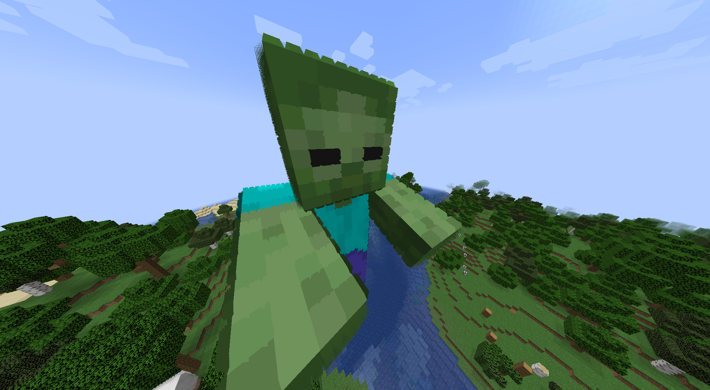

# Furry
Acerola (computer graphics guy) is hosting an event where audience members implement shell texturing.

This mod hopes to make entities covered in shells and thus appear deceptively fluffy and furry.

# Usage

Use the command `/furryCycle` to change between the different modes.

Use the commands `/furry_shell_<setting> <num>` to customize the shell texture.

# Demonstration Video
https://youtu.be/UstU1shivFU

# Requirements
* minecraft fabric 1.20.2
* fabric api version >=0.14.23

## Note: this mod overwrites the `ModelPart.Cuboid` class
This means it will probably be incompatible with a lot of other mods like sodium and such.

# Pics

